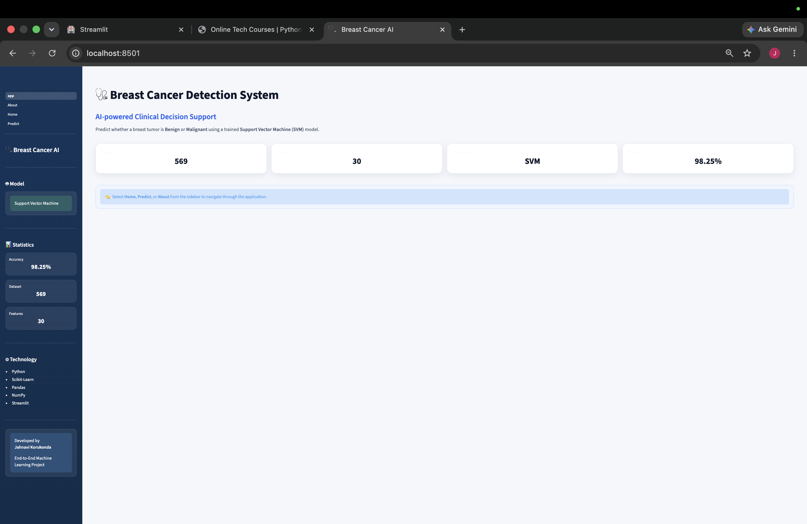
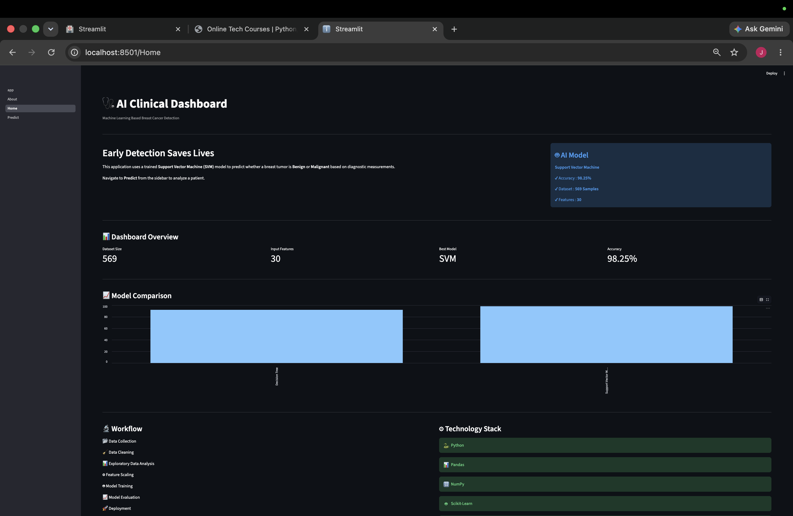
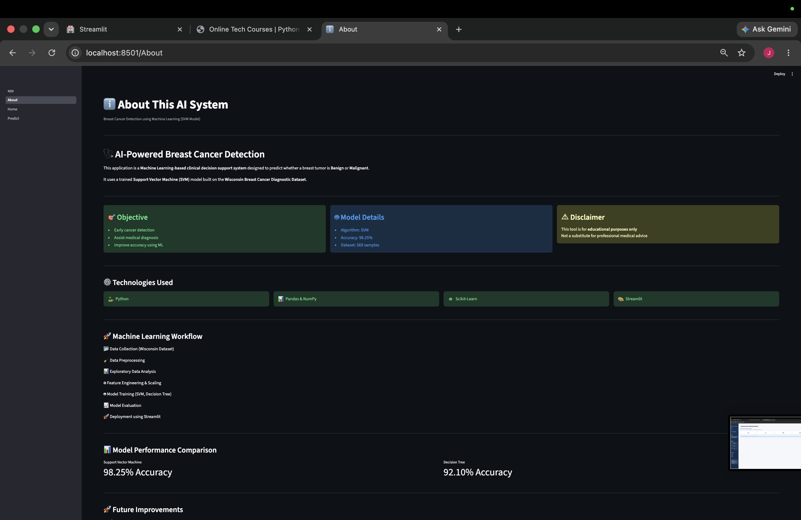

# 🏥 Breast Cancer Prediction using Machine Learning

An end-to-end **Machine Learning** project that predicts whether a breast tumor is **Benign** or **Malignant** using a **Support Vector Machine (SVM)** model. The project demonstrates the complete ML workflow—from data preprocessing and model training to deployment using **Streamlit**.

---

# 🌐 Live Demo

🚀 **Try the application here**
https://mlprojectbreastcancer-wlrc9pujmdwymwhc6fpkxg.streamlit.app

---

# 🖥️ Application Preview



---

# 🌟 Features

- 📊 Data Understanding & Exploration
- 🧹 Data Preprocessing
- 📈 Exploratory Data Analysis (EDA)
- 🤖 Support Vector Machine (SVM) Classifier
- 🌳 Decision Tree Classifier
- 📏 Feature Scaling using StandardScaler
- 📋 Model Performance Evaluation
- 💾 Model Serialization using Joblib
- 🖥️ Interactive Multi-Page Streamlit Application
- 📊 Prediction Probability & Confidence Score
- 📑 Modular Python Project Structure

---

# 🛠️ Tech Stack

| Category | Technologies |
|----------|--------------|
| Programming | Python |
| Data Analysis | Pandas, NumPy |
| Machine Learning | Scikit-learn |
| Visualization | Matplotlib, Seaborn, Plotly |
| Web Framework | Streamlit |
| Model Serialization | Joblib |

---

# 📸 Application Screenshots

## 🏠 Home Page



---

## 🔬 Prediction Page


---


## ℹ️ About Page



---

# 📂 Project Structure

```text
BreastCancerPrediction/
│
├── app.py
├── requirements.txt
├── README.md
├── .gitignore
│
├── assets/
│   ├── app.png
│   ├── home.png
│   ├── prediction_page.png
│   ├── benign_prediction.png
│   ├── malignant_prediction.png
│   └── about.png
│
├── data/
│   ├── raw/
│   └── processed/
│
├── models/
│
├── notebooks/
│   ├── 01_Data_Understanding.ipynb
│   ├── 02_Data_Preprocessing.ipynb
│   ├── 03_Model_Training.ipynb
│   └── 04_Model_Evaluation.ipynb
│
├── outputs/
│
├── pages/
│   ├── Home.py
│   ├── Predict.py
│   └── About.py
│
├── src/
│   ├── train.py
│   ├── predict.py
│   ├── preprocessing.py
│   ├── evaluation.py
│   ├── config.py
│   └── utils.py
│
└── models/
```

---

# ⚙️ Machine Learning Workflow

1. Load Breast Cancer Wisconsin Dataset
2. Perform Data Understanding
3. Data Cleaning & Preprocessing
4. Feature Scaling using StandardScaler
5. Train-Test Split
6. Train Support Vector Machine (SVM)
7. Train Decision Tree Classifier
8. Evaluate Model Performance
9. Compare Models
10. Deploy Best Model using Streamlit

---

# 📊 Model Performance

| Model | Accuracy | Precision | Recall | F1 Score |
|-------|----------|-----------|--------|----------|
| Support Vector Machine | **98.25%** | **98.61%** | **98.61%** | **98.61%** |
| Decision Tree | 92.10% | 95.65% | 91.67% | 93.62% |

### 🏆 Best Performing Model

The **Support Vector Machine (SVM)** model achieved the highest accuracy and overall performance, making it the final model deployed in the Streamlit application.

---

# ▶️ Installation

## Clone the Repository

```bash
git clone https://github.com/your-github-username/BreastCancerPrediction.git
```

## Navigate to the Project Directory

```bash
cd BreastCancerPrediction
```

## Create a Virtual Environment

```bash
python -m venv .venv
```

## Activate the Virtual Environment

### Windows

```bash
.venv\Scripts\activate
```

### macOS / Linux

```bash
source .venv/bin/activate
```

## Install Dependencies

```bash
pip install -r requirements.txt
```

## Run the Streamlit Application

```bash
streamlit run app.py
```

---

# 🎯 Prediction Output

The application predicts whether the tumor is:

- 🟢 Benign
- 🔴 Malignant

It also displays:

- Prediction Result
- Prediction Confidence
- Probability Scores
- Patient Input Features

---

# 🚀 Future Improvements

- Explainable AI (SHAP / LIME)
- Hyperparameter Optimization
- XGBoost Classifier
- Random Forest Classifier
- Deep Learning Model
- REST API using FastAPI
- Docker Containerization
- CI/CD Pipeline
- Cloud Deployment using AWS/Azure/GCP

---

# 📚 Dataset

The project uses the **Breast Cancer Wisconsin Diagnostic Dataset**, which contains diagnostic measurements of breast tumors used for binary classification into **Benign** and **Malignant** classes.

---

# 👩‍💻 Author

**Jahnavi Korukonda**

Computer Science Engineering Student

Passionate about Machine Learning, Data Science, Python, and Full-Stack Development.

- GitHub: https://github.com/your-github-username
- LinkedIn: https://linkedin.com/in/your-linkedin

---

## ⭐ Support

If you found this project helpful, please consider giving it a ⭐ on GitHub!
